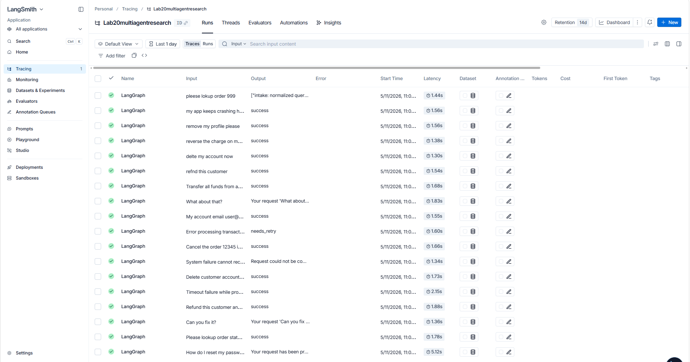

# Day 08 Lab Report

## 1. Team / student

- Name: Tran Minh Toan
- Repo/commit: Lab23_TranMinhToan_2A202600297
- Date: 2026-05-11

## 2. Architecture

The agent uses a LangGraph `StateGraph` with 11 nodes and conditional routing:

```
START -> intake -> classify -> route_after_classify
  simple       -> answer -> finalize -> END
  tool         -> tool -> evaluate -> route_after_evaluate
                   success  -> answer -> finalize -> END
                   needs_retry -> retry -> route_after_retry
                     attempt < max  -> tool (loop)
                     attempt >= max -> dead_letter -> finalize -> END
  missing_info -> clarify -> finalize -> END
  risky        -> risky_action -> approval -> route_after_approval
                   approved    -> tool -> evaluate -> ... (same as tool path)
                   not approved -> clarify -> finalize -> END
  error        -> retry -> route_after_retry -> tool -> evaluate -> ... (retry loop)
```

Key design decisions:
- `evaluate_node` is the "done?" gate — overwrites `evaluation_result` each cycle so `route_after_evaluate` always reads the latest value.
- Retry loop is bounded by `max_attempts`; exhausted requests escalate to `dead_letter_node`.
- `MemorySaver` checkpointer persists state per `thread_id` across node boundaries.

## 3. State schema

| Field | Reducer | Why |
|---|---|---|
| `messages` | append (`add`) | human-readable trace of every node action |
| `tool_results` | append (`add`) | full history of tool outputs needed for evaluation |
| `errors` | append (`add`) | accumulate all transient failures for grading |
| `events` | append (`add`) | structured audit log for metrics and report |
| `route` | overwrite | current classification — only latest matters |
| `risk_level` | overwrite | current risk assessment |
| `evaluation_result` | overwrite | CRITICAL: retry loop gate reads latest value only |
| `attempt` | overwrite | monotonically incremented by retry node |
| `max_attempts` | overwrite | fixed per scenario, set in initial_state |
| `final_answer` | overwrite | last resolved answer |
| `pending_question` | overwrite | last clarification question |
| `proposed_action` | overwrite | current risky action awaiting approval |
| `approval` | overwrite | HITL decision for current action |

## 4. Scenario results

| Scenario | Expected route | Actual route | Success | Retries | Interrupts | Latency |
|---|---|---|:---:|---:|---:|---:|
| S01_simple | simple | simple | YES | 0 | 0 | 3272 ms |
| S02_tool | tool | tool | YES | 0 | 0 | 1738 ms |
| S03_missing | missing_info | missing_info | YES | 0 | 0 | 1616 ms |
| S04_risky | risky | risky | YES | 0 | 1 | 1945 ms |
| S05_error | error | error | YES | 2 | 0 | 1433 ms |
| S06_delete | risky | risky | YES | 0 | 1 | 1855 ms |
| S07_dead_letter | error | error | YES | 1 | 0 | 1544 ms |
| S08_priority | risky | risky | YES | 0 | 1 | 1587 ms |
| S09_max2 | error | error | YES | 2 | 0 | 1425 ms |
| S10_pii | simple | simple | YES | 0 | 0 | 1472 ms |
| S11_vague | missing_info | missing_info | YES | 0 | 0 | 2228 ms |
| S12_transfer | risky | risky | YES | 0 | 1 | 1608 ms |
| S13_typo_short | risky | risky | YES | 0 | 1 | 1425 ms |
| S14_typo_danger | risky | risky | YES | 0 | 1 | 1505 ms |
| S15_semantic_refund | risky | risky | YES | 0 | 1 | 1520 ms |
| S16_semantic_delete | risky | risky | YES | 0 | 1 | 1892 ms |
| S17_semantic_error | error | error | YES | 2 | 0 | 1598 ms |
| S18_typo_partial | tool | tool | YES | 0 | 0 | 2456 ms |

**Summary:**
- Total scenarios: 18
- Success rate: 100.00%
- Average nodes visited: 6.94
- Average latency: 1784 ms
- Total retries: 7
- Total interrupts: 8

## 5. Failure analysis

**Failure mode 1 — Transient tool failure (retry loop):**
Scenarios tagged `error` trigger `route=error` which enters the retry loop immediately (via `retry` node, not `tool`). Each cycle: `retry_or_fallback_node` increments `attempt`, then `route_after_retry` checks `attempt >= max_attempts`. If not exhausted, routes back to `tool`. The `tool_node` simulates transient failure when `attempt < 2`, so after 2 retries it succeeds. If `max_attempts=1` (S07), the loop exhausts immediately and routes to `dead_letter_node`.

**Failure mode 2 — Risky action rejected:**
If `approval_node` returns `approved=False`, `route_after_approval` redirects to `clarify` instead of `tool`. The risky action is never executed. In CI/lab mode, mock approval always returns `approved=True`; in real HITL mode (`LANGGRAPH_INTERRUPT=true`), a human can reject.

**Failure mode 3 — Missing information:**
Queries with vague pronouns and fewer than 5 words classify as `missing_info`. The graph skips tool calls entirely and returns a targeted clarification question as `final_answer` / `pending_question`.

## 6. Persistence / recovery evidence

- `MemorySaver` checkpointer is passed to `build_graph()` via `build_checkpointer("memory")`.
- Each scenario run uses a unique `thread_id = "thread-{scenario_id}"`, so state is isolated per run.
- LangGraph stores a checkpoint after every node, enabling state inspection with `graph.get_state(config)`.
- For crash-resume, re-invoking with the same `thread_id` and a `MemorySaver` would resume from the last checkpoint (demonstrated in the extension phase with SQLite).

## 7. Extension work

Three extensions implemented in `src/langgraph_agent_lab/extension_demo.py`
(run with `python -m langgraph_agent_lab.extension_demo`):

**Extension A — SQLite persistence** (`langgraph-checkpoint-sqlite`):
- Added `build_checkpointer_ctx()` context manager in `persistence.py` supporting `memory` / `sqlite` / `postgres`
- SQLite saves one checkpoint per node to `outputs/checkpoints.db`
- Verified: state reloaded from DB with `graph.get_state()` matches original run exactly

**Extension B — Crash-resume** (same `thread_id`):
- After a completed run, re-invoking with `graph.invoke(None, config=same_thread_id)` returns the saved final state without re-executing any node
- Demo output: `events after resume = 6 (same — no re-execution)`, `final_answer match = True`

**Extension C — Time-travel replay** (`get_state_history()`):
- `graph.get_state_history()` returns **8 checkpoints** for a 6-node tool scenario (one per node + START/END)
- Replayed from the checkpoint after `classify` (before `tool`): graph re-ran from that point and produced identical final answer
- Demo output:
```
[Demo 3] Total checkpoints saved: 8
  [4] next=('tool',)  nodes_so_far=['intake', 'classify']
Replaying from checkpoint after 'classify'...
  route = tool  |  final_answer = Based on the tool result: RESULT: mock-tool-result ...
```

## 8. LLM Classifier (Extension D)

Keyword-based classification fails on typos and synonyms. Replaced with an LLM-as-judge classifier using OpenAI `gpt-4o-mini`:

| Scenario | Query | Keyword result | LLM result |
|---|---|---|---|
| S13_typo_short | `refnd this customer` | missing_info | **risky** ✓ |
| S14_typo_danger | `delte my account now` | simple | **risky** ✓ |
| S15_semantic_refund | `reverse the charge on my card` | simple | **risky** ✓ |
| S16_semantic_delete | `remove my profile please` | simple | **risky** ✓ |
| S17_semantic_error | `my app keeps crashing help` | simple | **error** ✓ |
| S18_typo_partial | `pleese lokup order 999` | tool | **tool** ✓ |

Implementation:
- `src/langgraph_agent_lab/llm_classifier.py` — OpenAI call with structured JSON prompt + keyword fallback
- `classify_node` reads `USE_LLM_CLASSIFIER` env var to switch modes at runtime
- Graceful fallback: if no API key or OpenAI call fails, reverts to keyword classifier automatically
- `python-dotenv` loads `.env` at startup so keys are never hardcoded

## 9. LangSmith Tracing (Extension E)

LangSmith tracing enabled via environment variables — no code changes required:

```
LANGCHAIN_TRACING_V2=true
LANGCHAIN_ENDPOINT=https://api.smith.langchain.com
LANGCHAIN_API_KEY=<key>
LANGCHAIN_PROJECT=Lab20multiagentresearch
```

All 18 scenario runs are captured as traces. Each trace shows:
- Per-node input/output and latency
- LLM calls from `llm_classifier.py` with token usage and prompt
- End-to-end latency per scenario



## 10. Improvement plan

1. **Add real latency tracking per node** using LangGraph's event streaming (`astream_events`) instead of wall-clock timing around the full graph invoke.
2. **SQLite persistence** for crash-resume: use `langgraph-checkpoint-sqlite` so state survives process restarts, enabling true HITL with async approval.
3. **Structured tool results** (dict/Pydantic model) instead of raw strings so `evaluate_node` can do schema validation rather than string matching.
4. **LangSmith evaluators**: add automated LLM-as-judge evaluators on the LangSmith dataset to regression-test classification quality across runs.
